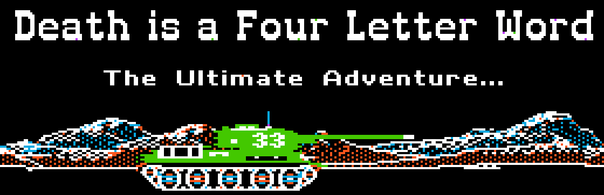

Death is a Four Letter Word: DIAFLW
===================================
|MIT| |APPLE| |Itch|

.. |MIT| image:: https://img.shields.io/badge/License-MIT-yellow.svg
   :target: https://opensource.org/licenses/MIT

.. |APPLE| image:: https://img.shields.io/badge/Apple%20II-ProDOS-0000C0.svg?logo=apple&logoColor=ee0000
   :target: https://github.com/AppleWin/AppleWin

.. |Itch| image:: https://img.shields.io/badge/Itch.io-fa5c5c.svg
   :target: https://myleftgoat.itch.io/diaflw?secret=50yDyW9gEaXGdvbVIRAq7yh3h4M

Overview
--------
Around 1986, a group of high-school Apple II enthusiasts decided to write a game.
The result was a game "system" called Death is a Four Letter Word (DIAFLW) that
consisted of a runtime engine and simple editors that allowed for the creation of
custom "scenarios".  The game was originally written for DOS 3.3, but was hastily
converted to ProDOS as it was obvious that the scenarios would be getting to
large.

The game was pitched to SoftDisk Magazine and some work was started on converting
it to their needs.  The project was never finished.

In 2024, the original source code to the game was unearthed and the original
programmer decided to fix up the project enough so that it was playable again.
The resulting source code is in this repo and one can download a generated
disk image from itch.io.

Details
-------
The game is written in 6502 assembly, but some of the code was entered in the
mini-assembler.  Thus source code for 95% of the game exists in Merlin format.

There is a build script in this repo that is capable of generating a .2mg file 
from the sources.  It requires several tools to be installed:

- Python
- `Merlin32 Assembler <https://brutaldeluxe.fr/products/crossdevtools/merlin/>`_
- `CiderPress II <https://ciderpress2.com/>`_
- `fhpack.exe <https://github.com/fadden/fhpack>`_

If one places the CiderPress CLI in a subdirectory named 'ciderpress' (ciderpress/cp2.exe)
and places the Merlin package in a subdirectory named 'merlin32' 
(merlin32\\Windows\\Merlin32.exe), then the following commands will build
the `DIAFLW_Release.2mg` file:

.. code::

   python -m virtualenv venv
   .\venv\Scripts\activate.ps1
   python build.py

One can adjust the pathnames to CiderPress and Merlin at the top of the build.py file.

Note: fhpack.exe is optional.  It allows for the splash and play background images to
be changed.  It is used to compresses image files to save memory.  It can be built using
the cygwin C compiler very easily. Having a copy of `fhpack.exe` and `cygwin1.dll` 
at the top of the source tree will meet the requirement. 

Documentation and Issues
------------------------
Documentation for the game and editors is included in the DIAFLOW.DOCS text file
included in the disk image.  There is a READ.DOCS system file that can be used 
to view the file.   Alternatively, the source to the docs file is 
available `here <diaflw_docs.txt>`_.

Please feel free to post issues and other questions at `DIAFLW Issues
<https://github.com/randall-frank/DIAFLW/issues>`_. This is the best place
to post questions and code.

License
-------
`DIAFLW` is licensed under the MIT license.

